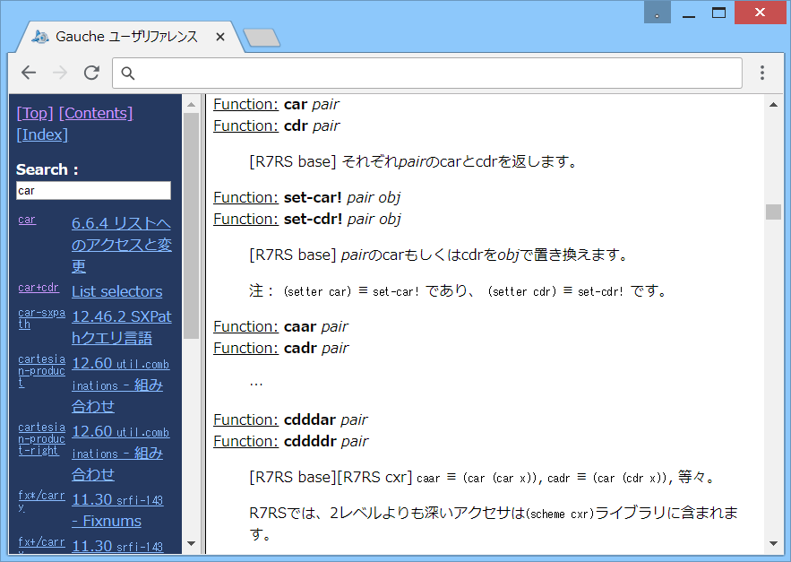

# Gauche-refj-isearch



## 概要
- Gauche の開発最新版のソースから、インクリメンタルサーチ機能付きの  
  リファレンスマニュアル (HTMLファイル) を生成するツールです。  
  実行には、ビルドのための開発環境が必要です。


## マニュアルの生成手順
1. 事前準備  
   事前に、Gauche のインストール、開発環境のインストール、  
   Gacuhe の開発最新版のソースの取得、および、コンパイルが必要になります。  
   Windows の場合には、以下のページを参考に実施ください。  
   https://gist.github.com/Hamayama/6666e5d2c8d5167d22f7

2. 本ツールのダウンロードとコピー  
   本サイト( https://github.com/Hamayama/Gauche-refj-isearch )のファイルを、  
   (Download Zip ボタン等で)ダウンロードして、適当なフォルダに展開してください。  
   そして中のファイル一式を、Gauche のソースの doc フォルダ内にコピーしてください。

3. 本ツールの実行  
   シェルからコマンドを実行します。  
   ＜MSYS2/MinGW-w64 (64bit) 環境の場合＞  
   プログラムメニューから MSYS2 の MinGW-w64 Win64 Shell を起動して、以下のコマンドを実行してください。  
   ＜MSYS2/MinGW-w64 (32bit) 環境の場合＞  
   プログラムメニューから MSYS2 の MinGW-w64 Win32 Shell を起動して、以下のコマンドを実行してください。  
   ( c:\work にソースを展開した場合)
   ```
   cd /c/work/Gauche/doc
   ./1001_makehtml_isearch.sh
   ```
   成功すると、以下の ファイル/フォルダ が doc フォルダ内に生成されます。  
   (データが分割されるかどうかは、使用したHTML生成ツールの種類によって決まります)
   ```
   gauche-refe-isearch.html        英語版の起動用HTMLファイル
   gauche-refe-isearch-input.html  英語版の検索処理用HTMLファイル
   gauche-refe-isearch-main.html   英語版のデータ(データ分割時にはフォルダになります)
   gauche-refj-isearch.html        日本語版の起動用HTMLファイル
   gauche-refj-isearch-input.html  日本語版の検索処理用HTMLファイル
   gauche-refj-isearch-main.html   日本語版のデータ(データ分割時にはフォルダになります)
   ```
   (注意) Makefile が見つからないというエラーが出る場合は、  
   一度 Gauche のソースをコンパイルしてから、上記コマンドを実行してください。


## マニュアルの使い方
- 生成された起動用HTMLファイルを、ブラウザで開くと、マニュアルを参照できます。  
  左側には、インクリメンタルサーチ用のテキストボックスが表示されます。
- テキストボックスに文字を入力すると、下に検索結果が表示されます。  
  そして、検索結果をクリックすると、右側に説明が表示されます。
- テキストボックスの入力中に Enter キーを押すと、先頭の検索結果の説明が表示されます。
- テキストボックスの先頭に半角スペースを入力すると、その次の文字から始まる検索結果だけを表示します。  
  また、テキストボックスの末尾に半角スペースを入力すると、その前の文字で終了する検索結果だけを表示します。


## その他、注意事項等
1. HTML生成ツールは、以下のいずれかを自動で検出して使用します。  
   (上から順番に検索して、最初に見つかったものを使用します)  
   texi2html か texi2any を使用した場合には、データは分割されてフォルダ内に格納されます。  
   
   ```
   ・texi2html (v1.82 で確認)
   ・texi2any  (v6.0  で確認)
   ・makeinfo  (v4.13 で確認)
   ```

2. 古いブラウザ(IE8,IE9等)では、インクリメンタルサーチ機能は使用できません。  
   その場合は、インクリメンタルサーチ機能が非表示になります。  
   (遅くて固まるため、使えないようにしました)

3. 検索用のデータは、「手続きと構文索引」「モジュール索引」「字句構文索引」「クラス索引」「変数索引」  
   から、そのまま抽出しています。このため、検索結果がABC順にならない部分があります。


## 参考情報
1. インクリメンタルサーチ対応 Gauche ユーザリファレンス  
   http://www.callcc.net/gauche/refj/  
   (ユーザーインターフェースと索引の検索方法を参考にしました)


## 環境等
- OS
  - Windows 8.1 (64bit)
- 環境
  - MSYS2/MinGW-w64 (64bit/32bit) (texi2html v1.82, texi2any v6.0)
  - MinGW (32bit) (makeinfo v4.13)
- 言語
  - Gauche v0.9.5
- ブラウザ
  - Chrome v54

## 履歴
- 2016-2-16  v1.00 (初版)
- 2016-2-18  v1.01 HTML分割対応
- 2016-2-18  v1.02 texi2html使用時のフッターのユーザ名表示を消去。検索処理の見直し等
- 2016-2-18  v1.03 検索処理の不要行削除等
- 2016-2-18  v1.04 表示調整等
- 2016-2-18  v1.05 エラー処理追加
- 2016-2-19  v1.06 texi2html使用時の日本語のカタログを無効化
- 2016-2-19  v1.07 索引抽出処理見直し
- 2016-2-19  v1.08 検索処理の不要行削除等
- 2016-2-19  v1.09 検索結果の余白調整
- 2016-2-19  v1.10 HTMLのフレーム設定修正
- 2016-2-20  v1.11 検索処理見直し等
- 2016-2-20  v1.12 検索処理見直し等
- 2016-2-21  v1.13 検索を行わないキーを追加(Tab/Shift/Ctrl/Alt)
- 2016-2-21  v1.14 検索用のデータにモジュール索引等のデータも追加。検索処理一部見直し等
- 2016-2-21  v1.15 索引抽出処理見直し
- 2016-2-22  v1.16 エラー処理追加
- 2016-2-27  v1.17 HTMLのヘッダー情報修正等
- 2016-2-28  v1.18 シェルスクリプトの処理一部見直し
- 2016-4-15  v1.19 シェルスクリプトの書式修正のみ
- 2016-5-7   v1.20 索引抽出処理一部見直し
- 2016-5-24  v1.21 Enterキーで検索を行わないようにした
- 2016-8-7   v1.22 1004_texi2html_init.pl の改行コード修正(CRLF→LF)
- 2016-10-13 v1.23 README修正等(Gauche v0.9.5 対応)
- 2016-10-15 v1.24 Gaucheの開発最新版に対応(フッター表示追加等)
- 2016-10-15 v1.25 texi2anyのオプション変更(タイトルOFF)
- 2016-10-15 v1.26 texi2anyのオプション変更(親URL仮設定)
- 2016-10-26 v1.27 texi2anyのオプション変更(クォートの位置見直し)


(2016-10-26)
